# embodied-ai-paper

## 1.[ACT](https://ar5iv.labs.arxiv.org/html/2304.13705?_immersive_translate_auto_translate=1)

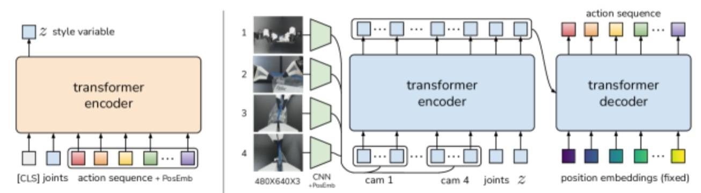

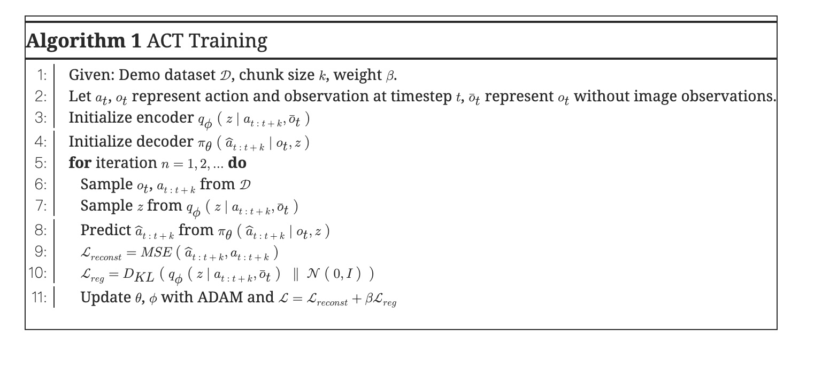

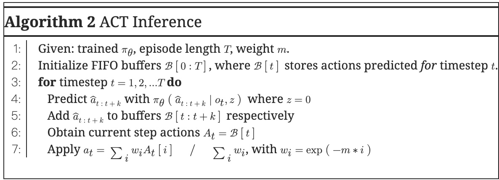

## 2.[RT-1](https://arxiv.org/html/2212.06817?_immersive_translate_auto_translate=1)

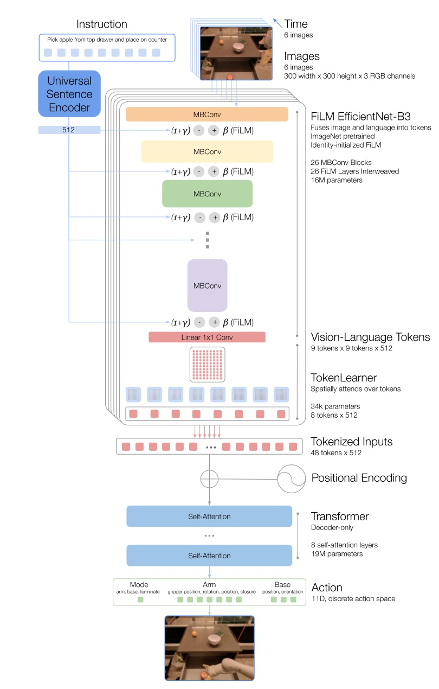

1.	**图像输入**（6帧历史图像）通过EfficientNet-B3提取视觉特征。

2. **语言输入**通过通用句子编码器生成嵌入向量。

3. **FiLM层**结合语言信息调整视觉特征。

4. **TokenLearner**提取重要的视觉特征标记。

5. **Transformer**接收筛选后的视觉特征标记和语言信息，生成动作标记。

6. 动作标记被解码为具体的机器人动作。

​	**缩放**（ 1 +  γ ）：

​	类似于调节特征的“亮度”或“权重”，强调重要特征或抑制无关特征。

​	**偏移**（ β ）：

​	类似于“移动特征值基线”，帮助特征适应任务需求。

## 3.[HPT](https://arxiv.org/html/2409.20537?_immersive_translate_auto_translate=1)

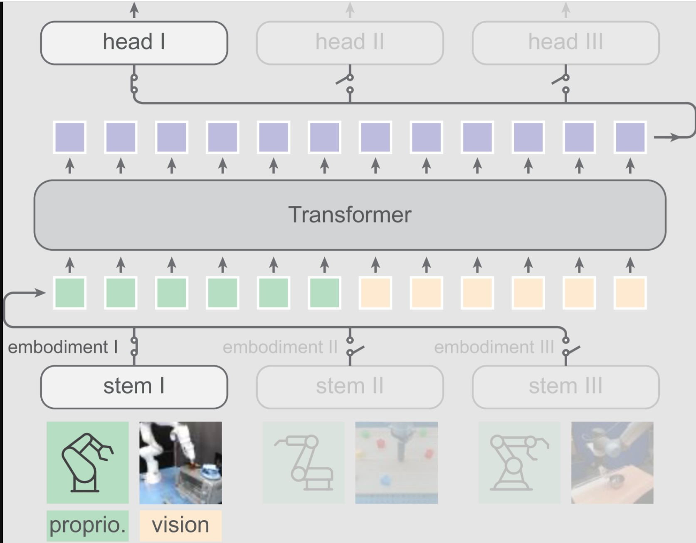

## 4.[RT-2](https://ar5iv.labs.arxiv.org/html/2307.15818?_immersive_translate_auto_translate=1)

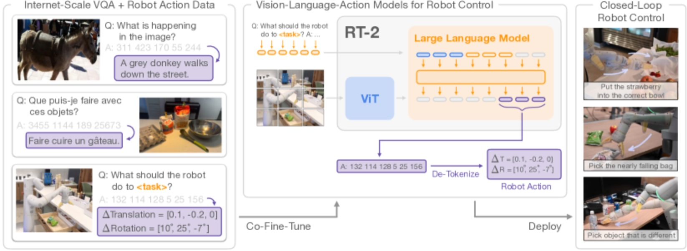

## 5.[OpenVLA](https://arxiv.org/html/2406.09246?_immersive_translate_auto_translate=1)

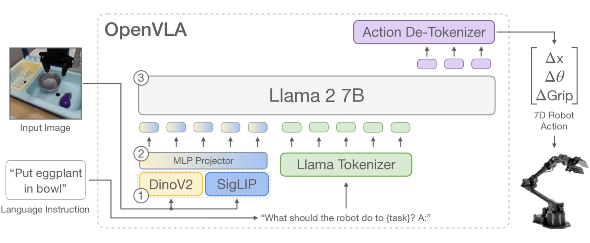

​	DinoV2 是一种视觉编码器，擅长提取 **低级细节和空间信息**

​    SigLIP 是一种视觉-语言预训练模型，专注于提取图像的 **高级语义特征**

## 6.[Diffusion Policy](https://ar5iv.labs.arxiv.org/html/2303.04137v4?_immersive_translate_auto_translate=1)

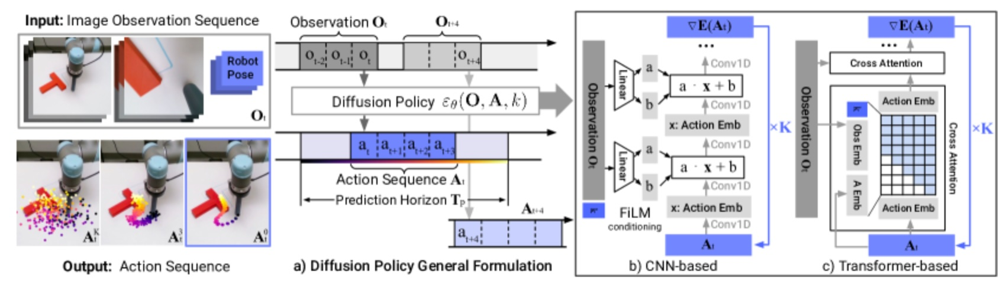

## 7.[RDT-1B](https://arxiv.org/html/2410.07864?_immersive_translate_auto_translate=1)

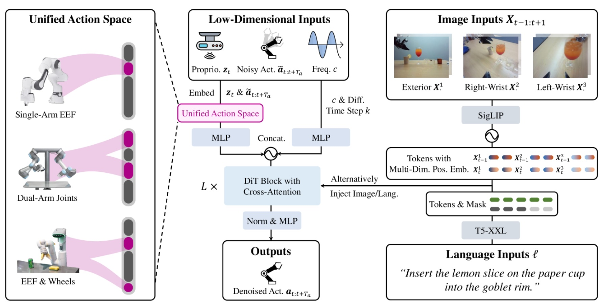

## 8.[Octo](https://arxiv.org/html/2405.12213?_immersive_translate_auto_translate=1)

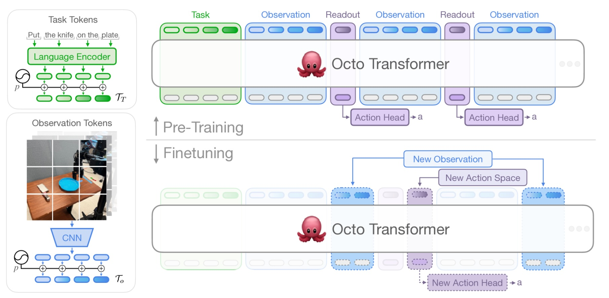

## 9.[π0](https://arxiv.org/html/2410.24164?_immersive_translate_auto_translate=1)

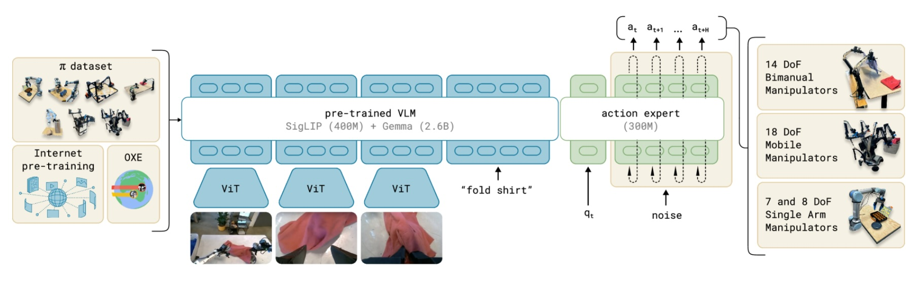

## 10. [ROSIE](https://ar5iv.labs.arxiv.org/html/2302.11550?_immersive_translate_auto_translate=1)

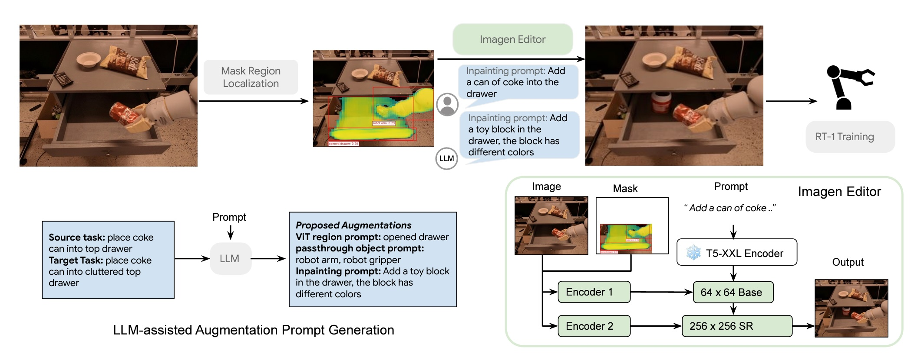

## 11. [VoxPoser](https://ar5iv.labs.arxiv.org/html/2307.05973?_immersive_translate_auto_translate=1)

